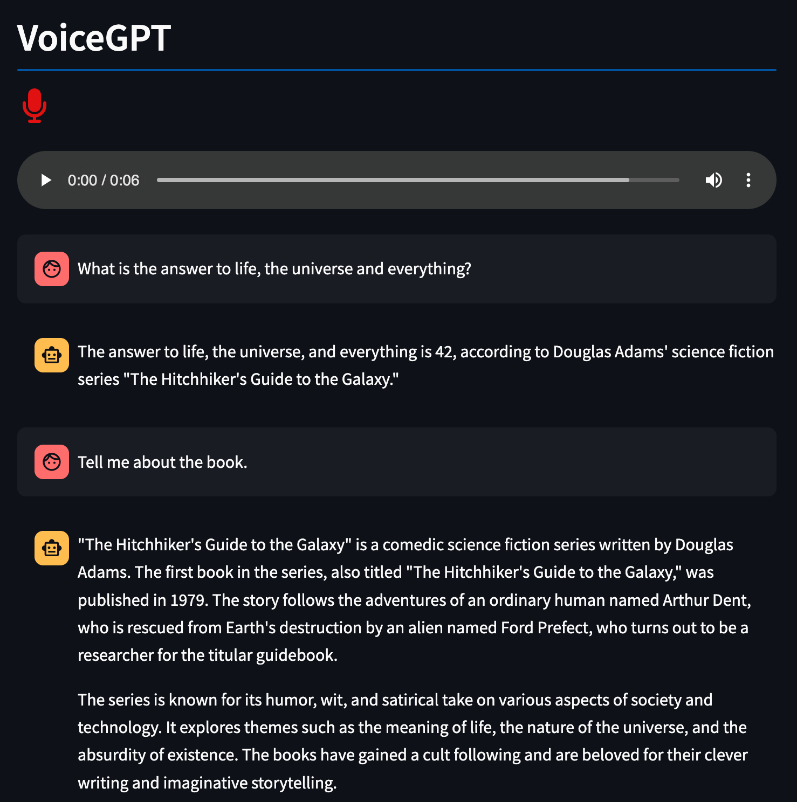

# voice-gpt

Introducing VoiceGPT – a convenient voice interface to ChatGPT. Simply speak to ChatGPT and enjoy engaging conversations or have some fun.

## Setup

Set your `OPENAI_API_KEY` as an environment variable.

```bash
export OPENAI_API_KEY='<your-key-here>'
```

Create a virtual environment and install all dependencies.

```bash
python3 -m venv .venv
source .venv/bin/activate
pip install -r requirements.txt
```

Run the application as

```bash
streamlit run ui.py
```

This should open the web interface at `localhost:8501`.


